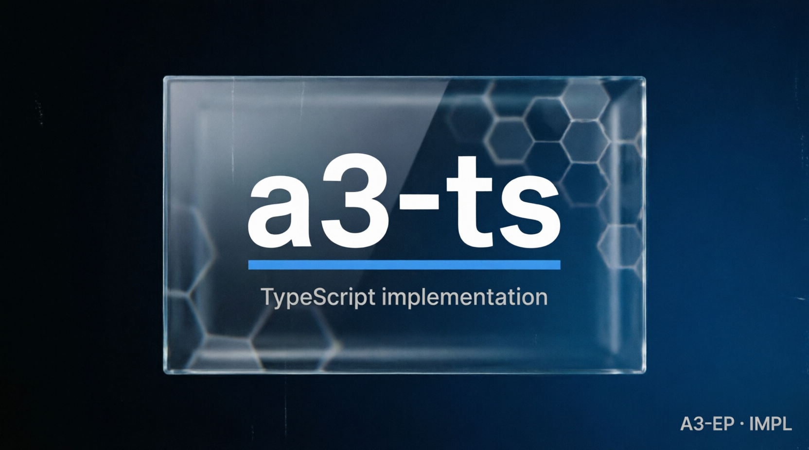

# a3-ts — A3-EP TypeScript reference



## What it is

A TypeScript reference implementation of A3-EP v0.2.0 with lock-vector v2 support, JCS serialization, CloudEvents, temporal ordering, truth, confidence, and attestation validation.

## What it is not

It is not a translation of the Kotlin or Go sources, not a UI renderer, and not evidence that a downstream deployment is production-ready.

## Status

- **VERIFIED:** TypeScript lock-vector and conformance tests, v1 parse compatibility, v2 canonical output, and CF-001..CF-009 rejection behavior.
- **UNVERIFIED:** physical deployment and third-party adoption.

## Get it

```bash
git clone https://github.com/valeriobitzone-png/a3-ts.git
cd a3-ts
# Requirements: Node.js >=20 and pnpm.
# INT-009 reads the normative spec and freeze state from this pinned sibling:
git clone https://github.com/valeriobitzone-png/a3.git ../a3
git -C ../a3 checkout closeout-v1.0
pnpm install
```

Structure: `src/` implementation, `test/` lock/conformance tests, and `REVIEW_A3_TS.md` audit evidence. Runtime dependencies are zero.

## Prove it

```bash
pnpm typecheck
pnpm test
```

Expected result: typecheck and all INT tests exit 0; lock v2 bytes match the declared SHA-256 values.

## Integrate it

Use the reference tests as a template when implementing A3-EP in another language. Keep the documented `../a3` checkout at `closeout-v1.0`, read `../a3/spec/SPEC_A3-EP.md` as the contract, and compare your canonical bytes to the shared lock vectors; do not copy implementation code.

## License

Implementation code is Apache-2.0. The governing protocol specification and shared schemas are CC BY 4.0 in `../a3/spec/`.

## Provenance

Measured: test results, canonical bytes, and SHA-256 lock comparisons. Deducted or unverified: behavior outside the declared test corpus and downstream production use. The review records the exact vectors and known floating-point divergence.
